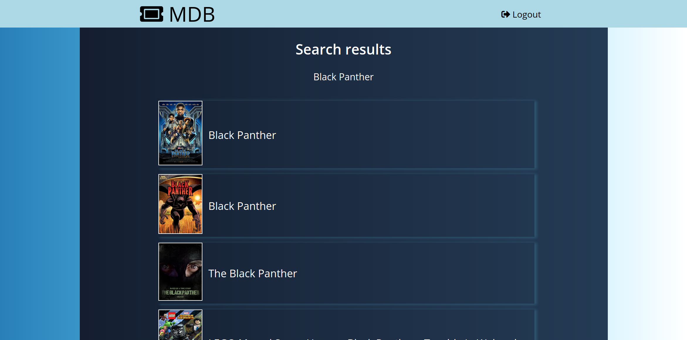

# MDB
An IMDB clone

Table of contents

------------------
1. <a href="#about">About the project</a>
1. <a href="#stack">Built with</a>
1. <a href="#home">The homepage</a>
1. <a href="#results">Results page</a>
1. <a href="#movie">Movies page</a>
1. <a href="#responsive">Responsiveness</a>
1. <a href="#contact">Contacr</a>
1. <a href="#ack">Acknowledgement</a>

--------------------

<h2 id="about">About the project</h2>
It's a movies database app, inspired from IMDB. The selling point of this app is that it contains reviews from all the top 3 movie review services (IMDB, Rotten Tomatoes and Metacritic). Also, user can post their own reviews about their favourite films. 

<h2 id="stack">Built with</h2>
The app was built with the following stack

* FrontEnd
    * HTML
    * CSS
    * Javascript
* Backend
    * Node
    * Express
    * Other npm packages
* Database
    * Mysql       

<h2 id="home">The homepage</h2>
The homepage ('/') has a design similar to that of netflix. A sinple searchbar with a collage of film posters as the background

<h2 id="results">Results page</h2>
Ofcourse, the seearch reasults appear here.

<h2 id="movie">Movies Page</h2>
This page contains all the details about the selectid film.

<h2 id="responsive">Responsiveness</h2>

This is how the app looks link in an current gen smart phone

<h2 id="contact">Contact</h2>
Linkedin: <a href="https://www.linkedin.com/in/karthik-s-p-%F0%9F%87%AE%F0%9F%87%B3-931345122/"> Karthik S P</a>

Portfolio: <http://www.karthiksp.in/>

<h2 id="ack">Acknowledgement</h2>

* [OMDB]('http://www.omdbapi.com/')